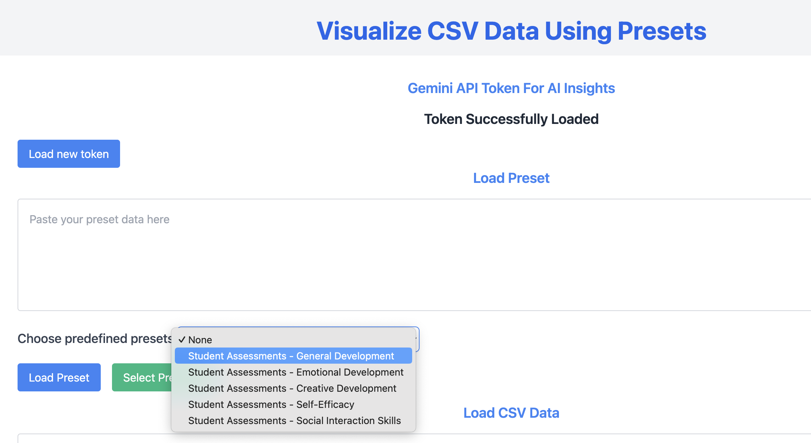

# What is data-visualizer

A tool to easily visualize Student Progress during the [FacesUp MentorMe](https://facesup.org/mentor-me/) project. 

# Instructions
## One time preparation: API token
* Create a [Google account](https://myaccount.google.com/) and/ or log in
* Follow [Google's instructions](https://ai.google.dev/gemini-api/) to get an API key from the Google AI studio. After successful generation a popup will occur with the API key. The API key is a long sequence of characters and numbers. Copy and save the API key.
* Start the [data visualizer tool](https://faces-up-ngo.github.io/csv-data-visualizer/) and enter your API key in the corresponding field, then push the "Load Token" button.
  
* In the address bar of the browser, an updated URL will appear. We recommend bookmarking this URL as your personalized entry page for the data visualizer tool.

   `https://faces-up-ngo.github.io/csv-data-visualizer/?gemini-api-key=<you_api_key>`.

## How to view a student's progress
### Data preparation
In Airtable: Export the student intake form into a CSV file

### Data visualizer tool
* Make sure you are connected to the internet
* Start the [data visualizer tool](https://faces-up-ngo.github.io/csv-data-visualizer/), ideally use your bookmarked link with the API key. Enter the API key if not done previously.
* Choose your type of analysis by selecting a so-called "preset" from the dropdown list and press `load preset`.
  
* Upload the CSV data exported from Airatable by pressing  `load data file`.
* Choose a student and select `Visualize`
* Generate the AI summaries by pressing the `Generate Insights` button below each chart
* Export the student's report to PDF for offline use or printing

## How to create your own data analysis ("preset")
TODO

# Contributions

This project was created for FacesUp through the MovingWorlds program. Open tasks are managed in the [GitHub project](https://github.com/orgs/faces-up-ngo/projects/1).
Feel free to take a look for potential contributions and further tasks for extending to the tool.

# License

This project is licensed under the Apache Software License, version 2.0 except as noted otherwise in the [LICENSE](LICENSE.txt) file.
